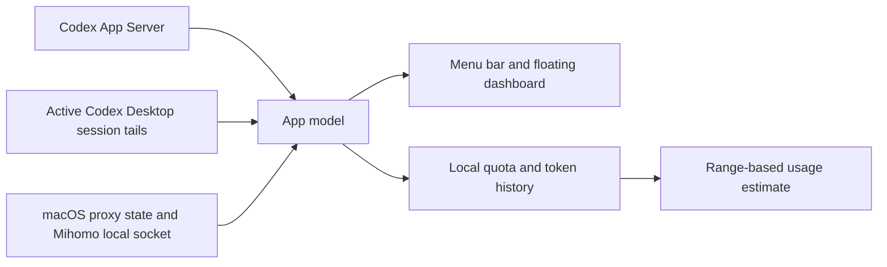

<div align="center">

# Codex Current

### A local-first Codex status dashboard for macOS

See official quota windows, active Codex Desktop tasks, and local VPN health without breaking your flow.

[简体中文](README.zh-CN.md) · [Data contract](docs/DATA_CONTRACT.md) · [Changelog](CHANGELOG.md) · [Build from source](#build-from-source)


</div>


> The preview uses fictional data. Codex Current v1.0 is ready to build from source. The generated app bundle is ad-hoc signed and is not yet distributed as a Developer ID-signed, Apple-notarized download.

## Why Codex Current?

Heavy Codex users usually need three answers before they can keep working confidently:

- **How much official quota is left, and when does each window reset?**
- **Are my Codex Desktop tasks still running, and what are they using?**
- **Is my local VPN or proxy healthy enough for the next request?**

Those signals live in different places. Codex Current brings them into a native menu-bar app and a pinnable floating panel, while keeping official values, direct local readings, estimates, and beta observations visibly separate.

## What V1.0 includes

### Codex quota and activity

- Official rate-limit windows with remaining percentage and reset time.
- Dynamic window names based on returned duration; no hard-coded “5-hour” or “weekly” claims.
- Official daily token activity.
- A local usage-range estimate only after enough observations exist.
- Dormant model-specific buckets stay hidden until they show activity.

### Codex Desktop task awareness — Beta

- Active task count and an expandable task list.
- Short request summary, model, reasoning effort, elapsed time, and per-turn token count when available.
- Local notifications for detected task completion or failure.
- Bounded, on-device observation of sessions currently opened by Codex Desktop.

### VPN and proxy health

- Clash Verge/Mihomo process and connection state.
- System proxy/TUN state, routing mode, selected AI group, node health, and recent latency.
- Local notification when the connection drops.
- No subscription-file, configuration-file, or secret reading.

### Native macOS experience

- Menu-bar access and a movable, resizable, always-on-top floating panel that adapts its height to the visible components and expanded task details, plus a one-click compact status-bar mode.
- Compact and expanded layouts.
- Show, hide, and reorder built-in cards.
- Automatic English and Simplified Chinese localization.
- Local history with an explicit clear action.

## Data labels you can trust

Codex Current does not present every number as equally certain.

| Label | Meaning | Example |
|---|---|---|
| **Official** | Returned by a documented Codex App Server method | Remaining quota, reset timestamp, daily token activity |
| **Local** | Read directly from bounded on-device state | VPN/proxy state, node health, and latency |
| **Estimated** | Calculated from enough local observations and shown as a range | Approximate time before a rate-limit window is depleted |
| **Beta** | Useful local observation with a known compatibility boundary | Codex Desktop task activity |
| **Unavailable** | No reliable value exists | Missing reset time or token baseline |

The field-level source and degradation rules are documented in [the data contract](docs/DATA_CONTRACT.md).

## Requirements

| Requirement | V1.0 support |
|---|---|
| macOS 14 Sonoma or later | Required |
| Apple silicon | Tested build target |
| Codex CLI or ChatGPT for macOS with bundled Codex | Required |
| ChatGPT/Codex-backed login | Supported |
| API-key-only or Amazon Bedrock session | Not supported for quota widgets |
| Codex Desktop task monitoring | Beta |
| Clash Verge/Mihomo | Supported |
| Other VPN clients | Not yet supported |

## Build from source

Clone the repository, then build and run the Swift package:

```sh
git clone https://github.com/shuhaochen618-svg/Codex-Current.git
cd Codex-Current
swift build
swift run CodexCurrent
```

Create an ad-hoc-signed local app bundle:

```sh
./scripts/build-app.sh release
open "dist/Codex Current.app"
```

Create the versioned ZIP and SHA-256 file used for a GitHub Release:

```sh
./scripts/package-release.sh
```

The resulting local bundle is intended for development and evaluation. Public binary distribution should use a stable bundle identifier, Developer ID signing, and Apple notarization.

## Verification

Run the deterministic model and history checks:

```sh
./scripts/test.sh
```

Run the privacy-limited live smoke checks:

```sh
./scripts/smoke-app-server.sh
./scripts/smoke-local-status.sh
```

The smoke scripts print only sanitized operational fields and counts. They do not print account identity, quota values, task titles, selected VPN nodes, or conversation content.

## Privacy and security

- Codex account data is requested through `codex app-server --stdio` using documented JSON-RPC methods.
- Codex Current does **not** read `~/.codex/auth.json`.
- Task monitoring reads a bounded tail of session files currently opened by Codex Desktop.
- The current request is normalized and truncated to 72 characters for display. It is not uploaded, logged, or separately persisted by Codex Current.
- Assistant messages and reasoning content are not parsed or displayed.
- Monitoring history stays in `~/Library/Application Support/CodexCurrent/history.json` until the user clears it. Existing history and dashboard preferences from the pre-release Codex Bar name are migrated automatically.
- Clash Verge/Mihomo is queried through its local Unix control socket; subscription and secret-bearing configuration files are not read.

Security issues should be reported privately as described in [SECURITY.md](SECURITY.md).

## How it works



The implementation is a native SwiftUI app with small, source-specific service adapters. See [the product brief](docs/PRODUCT_BRIEF.md) for the product boundary.

## Known limitations

- Task activity depends on Codex Desktop's current session event format and does not monitor arbitrary standalone Codex CLI processes.
- Per-turn token use appears only after the first token event establishes a baseline.
- The VPN adapter currently targets Clash Verge/Mihomo on macOS.
- Token activity is not converted directly into quota consumption; the estimate uses observed rate-limit percentage changes.
- V1.0 uses manual updates. Automatic updates are not included.
- The app has no custom production icon, Developer ID signature, or notarization yet.

## FAQ

<details>
<summary><strong>Does Codex Current need my OpenAI password or API key?</strong></summary>

No. It uses the local Codex App Server process and never reads the Codex authentication file.

</details>

<details>
<summary><strong>Does it upload my task prompts?</strong></summary>

No. A bounded, shortened current-request summary is processed in memory for the task card. It is not uploaded, logged, or separately stored.

</details>

<details>
<summary><strong>Why is Task activity marked Beta?</strong></summary>

It observes local session events for tasks currently opened by Codex Desktop. That format and coverage are not a stable public account-data contract, so the UI states the limitation instead of presenting the signal as official.

</details>

<details>
<summary><strong>Why is a returned model-specific quota missing?</strong></summary>

V1.0 hides a dormant model-specific bucket while its usage is zero. It remains in source data and appears after it becomes active.

</details>

## Contributing and license

Bug reports and focused proposals are welcome; please read [CONTRIBUTING.md](CONTRIBUTING.md) first.

An open-source license has not yet been selected. Until a `LICENSE` file is added, the repository is **not** licensed for reuse or redistribution. This decision must be completed before accepting external code contributions.

## Disclaimer

Codex Current is an independent community project. It is not affiliated with, endorsed by, or sponsored by OpenAI. Codex and OpenAI are trademarks of their respective owner.

The official protocol reference used by this project is the [Codex App Server documentation](https://developers.openai.com/codex/app-server/).
