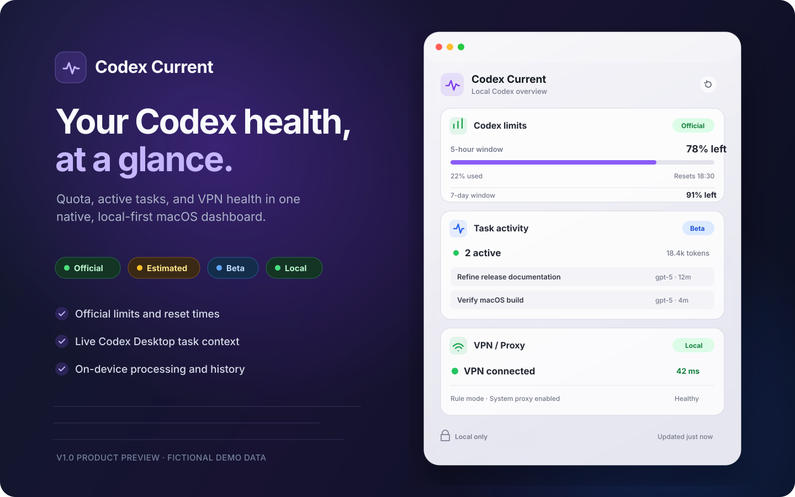
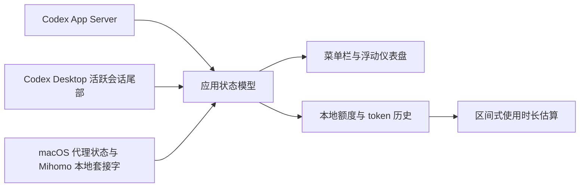

<div align="center">

# Codex Current

### 一眼看清 Codex 状态的本地 macOS 仪表盘

无需打断工作流，即可查看官方额度窗口、Codex Desktop 任务状态与本地 VPN 健康度。

[English](README.md) · [数据契约](docs/DATA_CONTRACT.md) · [更新记录](CHANGELOG.md) · [从源码构建](#从源码构建)


</div>



> 预览图使用虚构数据。Codex Current v1.0 已可从源码构建；当前生成的应用是临时签名版本，尚未作为经 Developer ID 签名和 Apple 公证的安装包公开分发。

## 为什么需要 Codex Current？

高频使用 Codex 时，往往需要先确认三件事：

- **官方额度还剩多少，各个窗口什么时候重置？**
- **Codex Desktop 里的任务是否仍在运行，使用了什么模型？**
- **本地 VPN 或代理是否健康，下一次请求能否顺利发出？**

这些信号原本分散在不同位置。Codex Current 将它们集中到原生菜单栏应用和可置顶浮窗中，并明确区分官方数据、本地直读、估算与测试功能。

## V1.0 包含什么

### Codex 额度与使用情况

- 显示官方返回的额度窗口、剩余比例和重置时间。
- 按实际返回的窗口时长动态命名，不擅自假设“五小时”或“每周”窗口。
- 显示官方每日 token 活动。
- 只有在本地观测充分时，才显示区间形式的使用时长估算。
- 尚未发生使用的模型专属额度默认隐藏，产生使用后再展示。

### Codex Desktop 任务感知 — Beta

- 显示运行中任务数量，并可展开查看任务列表。
- 在可用时显示简短请求摘要、模型、推理强度、运行时长与本轮 token 数。
- 对检测到的任务完成或失败发送本地通知。
- 仅在本机有限读取 Codex Desktop 当前打开会话的尾部内容。

### VPN 与代理健康度

- 检测 Clash Verge/Mihomo 进程和连接状态。
- 显示系统代理/TUN、路由模式、AI 分组、节点健康度和最近延迟。
- 连接断开时发送本地通知。
- 不读取订阅文件、配置文件或其中的密钥。

### 原生 macOS 体验

- 菜单栏入口，以及可移动、缩放和置顶的浮窗。
- 紧凑与展开两种显示密度。
- 可显示、隐藏并调整内置卡片顺序。
- 自动适配英文和简体中文。
- 历史数据仅保存在本机，并提供明确的清除操作。

## 数据可信度标签

Codex Current 不会把所有数字包装成同等可靠的“事实”。

| 标签 | 含义 | 示例 |
|---|---|---|
| **官方数据** | 来自 Codex App Server 已记录的方法 | 剩余额度、重置时间、每日 token 活动 |
| **本地直读** | 直接读取边界明确的本机状态 | VPN/代理状态、节点健康度和延迟 |
| **估算** | 基于充分的本地观测计算，并以区间展示 | 距离额度耗尽的大致时长 |
| **测试功能** | 有明确兼容边界的本地观测结果 | Codex Desktop 任务状态 |
| **暂不可用** | 当前不存在可靠数值 | 缺失重置时间或 token 基线 |

字段级数据来源和降级规则见[数据契约](docs/DATA_CONTRACT.md)。

## 环境要求

| 环境 | V1.0 支持情况 |
|---|---|
| macOS 14 Sonoma 或更高版本 | 必需 |
| Apple 芯片 | 当前测试构建目标 |
| Codex CLI，或内置 Codex 的 ChatGPT macOS 应用 | 必需 |
| ChatGPT/Codex 账号登录 | 支持 |
| 仅 API Key 或 Amazon Bedrock 会话 | 额度组件暂不支持 |
| Codex Desktop 任务监控 | Beta |
| Clash Verge/Mihomo | 支持 |
| 其他 VPN 客户端 | 暂不支持 |

## 从源码构建

克隆仓库并运行 Swift Package：

```sh
git clone https://github.com/shuhaochen618-svg/Codex-Current.git
cd Codex-Current
swift build
swift run CodexCurrent
```

生成临时签名的本地 `.app`：

```sh
./scripts/build-app.sh release
open "dist/Codex Current.app"
```

生成用于 GitHub Release 的版本化 ZIP 和 SHA-256 文件：

```sh
./scripts/package-release.sh
```

当前本地应用包用于开发和体验。正式公开分发二进制文件前，还需要稳定的 Bundle Identifier、Developer ID 签名和 Apple 公证。

## 验证

运行确定性的模型与历史记录测试：

```sh
./scripts/test.sh
```

运行受隐私约束的实时冒烟测试：

```sh
./scripts/smoke-app-server.sh
./scripts/smoke-local-status.sh
```

冒烟脚本只输出经脱敏的运行字段与计数，不输出账号身份、额度数值、任务标题、所选 VPN 节点或会话内容。

## 隐私与安全

- 通过 `codex app-server --stdio` 和已记录的 JSON-RPC 方法获取 Codex 账号数据。
- **不会**读取 `~/.codex/auth.json`。
- 任务监控只有限读取 Codex Desktop 当前打开会话的尾部内容。
- 当前请求会被规范化并截断到 72 个字符用于显示；不会被上传、写入日志或单独持久化。
- 不解析、不展示助手消息与推理内容。
- 监控历史只保存在 `~/Library/Application Support/CodexCurrent/history.json`，用户可随时清除；更名前 Codex Bar 的历史与仪表盘偏好会自动迁移。
- 仅通过本地 Unix 控制套接字查询 Clash Verge/Mihomo，不读取订阅和包含密钥的配置文件。

安全问题请按照 [SECURITY.md](SECURITY.md) 通过私密渠道报告。

## 工作原理



项目使用原生 SwiftUI，并按数据来源拆分为小型服务适配器。产品边界见[产品说明](docs/PRODUCT_BRIEF.md)。

## 已知限制

- 任务状态依赖 Codex Desktop 当前的会话事件格式，不监控任意独立 Codex CLI 进程。
- 只有首次 token 事件建立基线后，才会显示本轮 token 使用量。
- VPN 适配器当前只面向 macOS 上的 Clash Verge/Mihomo。
- token 活动不会被直接换算成额度消耗；估算仅依据观测到的额度百分比变化。
- V1.0 采用手动更新，不包含自动更新。
- 当前尚无正式产品图标、Developer ID 签名和 Apple 公证。

## 常见问题

<details>
<summary><strong>Codex Current 需要我的 OpenAI 密码或 API Key 吗？</strong></summary>

不需要。它使用本地 Codex App Server 进程，也不会读取 Codex 认证文件。

</details>

<details>
<summary><strong>它会上传我的任务提示词吗？</strong></summary>

不会。任务卡只在内存中处理当前请求的有限、缩短摘要，不上传、不写日志，也不单独保存。

</details>

<details>
<summary><strong>为什么“任务状态”被标记为测试功能？</strong></summary>

它观察 Codex Desktop 当前打开任务的本地会话事件。这些格式与覆盖范围不是稳定的官方账号数据契约，因此界面明确标注边界，不把它伪装成官方数据。

</details>

<details>
<summary><strong>为什么后端返回的某个模型额度没有显示？</strong></summary>

如果模型专属额度尚未产生任何使用，V1.0 会暂时隐藏该卡片；原始数据仍会保留，额度开始使用后会自动显示。

</details>

## 贡献与许可证

欢迎提交缺陷报告和聚焦的功能建议；参与前请先阅读 [CONTRIBUTING.md](CONTRIBUTING.md)。

项目尚未选定开源许可证。在添加 `LICENSE` 文件之前，本仓库的代码**不代表已授权复用或再分发**。接受外部代码贡献前必须先完成许可证决策。

## 声明

Codex Current 是独立的社区项目，与 OpenAI 不存在从属、背书或赞助关系。Codex 和 OpenAI 是其各自权利人的商标。

本项目所使用的官方协议参考为 [Codex App Server 文档](https://developers.openai.com/codex/app-server/)。
